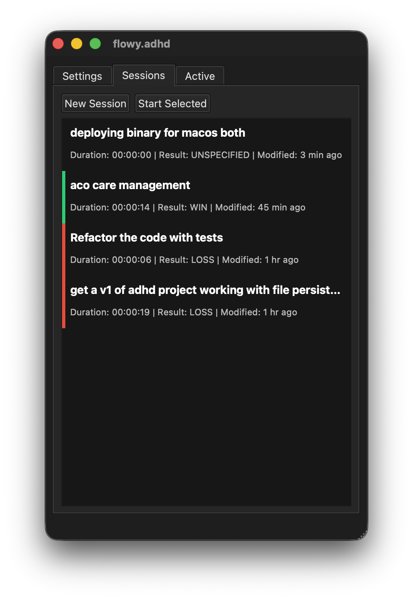

# Flowy.adhd

A simple focus app for macOS where you set an intention (one-liner) when you sit down on your computer. And there is an overlay that reminds you to stay on track.

And then you end the session, marking whether this session was a win or loss (e.g. completely distracted). This way, you have a log of your sessions, and you stay focused on one session at a time.

## The goal
If we are more aware of our intentions when we are on our computer, we can avoid distractions.

We also do not need much of a todo manager, as that can be productive procrastination. With Flowy.adhd, the entire goal is winning every session, and focusing on one thing at a time.

## Additional details
- NO sign in
- Local-only data: your sessions are stored as simple markdown files in a local folder

## Future work
- View past session notes
- Stats visualizer for wins vs. losses
